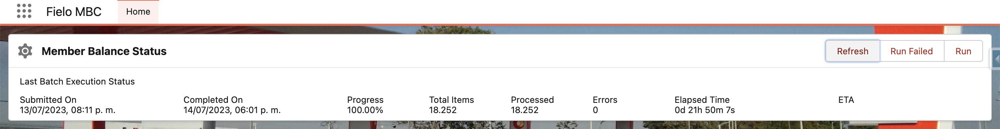

# FieloMBC - Member Balance Checker

Package to detect member balance inconsistency.

## How Do You Run FieloMBC?

- Install the latest version: [FieloMBC 1.7](https://login.salesforce.com/packaging/installPackage.apexp?p0=04tHY0000000VgmYAE)
- Assign the PermissionSet FieloMBCAdmin to your user
- Access in LEX > App Launcher > FieloMBC > Home
- Click on Run
