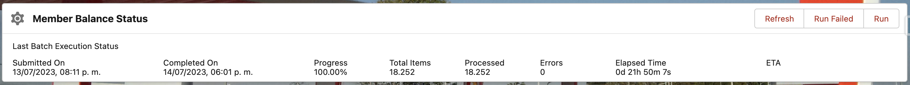

# FieloMBC - Member Balance Checker

Package to detect member balance inconsistency.

## Requirements

- FieloPLT 2.114.61 or newer.

## How Do You Run FieloMBC?

- Install the latest version: [FieloMBC 1.9.0](https://login.salesforce.com/packaging/installPackage.apexp?p0=04tHY0000000VjbYAE)
- Assign the PermissionSet FieloMBCAdmin to your user
- Access in LEX > App Launcher > FieloMBC > Home
- Click on Run

- Wait for it to finish

## Reading the Results

After the FieloMBC process finishes, the results will be saved in the object `FieloMBC__MemberBalanceStatus__c`

This Object has the following fields:
| Field | Description |
| :---- | ----------- |
| Member | (Lookup) Id of the member |
| Currency | (Lookup) Id of currency |
| Member Balance | (Decimal) Current Member Balance |
| Calculated Member Balance | (Decimal) Member Balance prior to all points plus "Points Total Sum" |
| Points Balance Sum | (Decimal) Sum of all point records Balance field of the member |
| Points Total Sum | (Decimal) Sum of all point records Total Points field of the member |
| Calculated Member Balance | (Flag) Y if there is a mismatch between Member Balance and Calculated Member Balance, N otherwise |
| Balance Mismatch | (Flag) Y if there is a mismatch between Member Balance and Points Balance Sum, N otherwise |
| Total Points Mismatch | (Flag) Y if there is a mismatch between Member Balance and Points Total Points Sum, N otherwise |

## Which Mismatch flag should You use?

- **Total Points Mismatch** if you have the entire points history in the database and you have negative accruals or not
- **Balance Mismatch** if you don't have negative accruals
- **Calculated Member Balance** if you want to check if all points were summed correctly